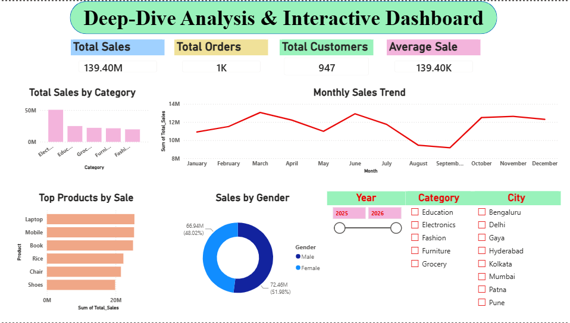
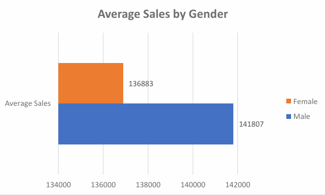

# 📊Chandrika Mellacheruvu Data Analyst Internship Portfolio

Welcome to my **Data Analyst Internship Portfolio**. This repository serves as a central hub for all the projects I completed during my internship. It showcases my learning journey, technical skills, and hands-on experience in data cleaning, analysis, visualization, SQL, and statistical validation.

---

# 👩‍💻 About Me

I'm **Chandrika Mellacheruvu**, a Computer Science student passionate about Data Analytics and Business Intelligence.

Throughout this internship, I worked on real-world datasets and completed end-to-end analytics projects using Python, SQL, Power BI, Excel, and GitHub. These projects helped me strengthen my problem-solving abilities and gain practical experience in transforming raw data into meaningful business insights.

---

# 🎯 Internship Objectives

- Clean and preprocess raw datasets
- Perform Exploratory Data Analysis (EDA)
- Create interactive Power BI dashboards
- Write SQL queries for business analysis
- Validate insights using statistical methods
- Present findings through effective data storytelling
- Document projects professionally using GitHub

---

# 🛠️ Skills Demonstrated

- Python
- Pandas
- NumPy
- SQL
- Power BI
- Microsoft Excel
- Data Cleaning
- Exploratory Data Analysis (EDA)
- Data Visualization
- Business Intelligence
- Hypothesis Testing
- Statistical Analysis
- GitHub
- Data Storytelling

---

# 📁 Internship Projects

## ✅ Task 1 – Data Cleaning & Preprocessing

### Objective

Prepare a raw dataset for analysis by handling missing values, duplicate records, inconsistent formatting, and incorrect data types.

### Skills Used

- Python
- Pandas
- Data Cleaning
- Data Validation

### Key Learning

- Handling missing values
- Removing duplicate records
- Formatting datasets
- Preparing clean data for analysis

### Repository

🔗 https://github.com/Chandrika-050406/Task1--Data-Immersion-Wrangling

---

## ✅ Task 2 – Exploratory Data Analysis & Business Intelligence Dashboard

### Objective

Analyze business data and build an interactive Power BI dashboard to identify trends and business insights.

### Skills Used

- Python
- Power BI
- Excel
- Data Visualization

### Dashboard Features

- KPI Cards
- Sales Analysis
- Product Analysis
- Customer Insights
- Category-wise Performance
- Interactive Filters

### Key Learning

- Understanding business metrics
- Dashboard design
- Visual storytelling
- Decision-making through analytics

### Repository

🔗https://github.com/Chandrika-050406/Task2-Exploratory-Data-Analysis-EDA-Business-Intelligence

---

## ✅ Task 3 – SQL Data Analysis

### Objective

Analyze business data using SQL queries to answer real-world business questions.

### Skills Used

- SQL
- Database Management
- Business Analytics

### SQL Concepts Covered

- SELECT
- WHERE
- GROUP BY
- ORDER BY
- Aggregate Functions
- Filtering
- Sorting

### Key Learning

- Querying databases
- Business reporting
- Data extraction
- SQL problem solving

### Repository

🔗 https://github.com/Chandrika-050406/Task-3-Deep-Dive-Analysis-Interactive-Dashboard

---

## ✅ Task 4 – Data Storytelling & Statistical Validation

### Objective

Validate business insights using statistical testing and communicate findings through data storytelling.

### Skills Used

- Python
- Statistics
- Power BI
- Data Visualization

### Topics Covered

- Hypothesis Testing
- Statistical Validation
- Business Storytelling
- Insight Generation
- Data Interpretation

### Key Learning

- Making data-driven decisions
- Validating assumptions
- Presenting business recommendations
- Communicating insights effectively

### Repository

🔗 https://github.com/Chandrika-050406/Task4-Data-Storytelling-Statistical-Validation

---

# 📈 Overall Learning

During this internship, I successfully completed the complete data analytics workflow, including:

- Data Cleaning
- Data Preprocessing
- Exploratory Data Analysis
- SQL Query Writing
- Dashboard Development
- Statistical Validation
- Business Storytelling
- GitHub Documentation

These projects strengthened both my technical knowledge and my ability to solve real-world business problems using data.

---

# 💻 Tools & Technologies

- Python
- Pandas
- NumPy
- SQL
- Power BI
- Microsoft Excel
- Jupyter Notebook
- Git
- GitHub

---

# 📸 Project Screenshots
## Power BI Dashboard

---

## Statistical Validation

---

# 🎓 Internship Reflection

This internship provided valuable hands-on experience in every stage of the data analytics process. From cleaning raw datasets to building interactive dashboards and validating insights with statistical methods, I gained practical exposure to solving real-world business problems using data.

Working on these projects improved my technical skills in Python, SQL, Power BI, Excel, and GitHub while also enhancing my analytical thinking, visualization skills, and ability to communicate insights effectively. This experience has strengthened my confidence and motivated me to continue learning and growing in the field of Data Analytics.

---

# 🔗 Connect With Me
## LinkedIn

https://www.linkedin.com/in/chandrika-mellacheruvu-834529321/

---

# ⭐ Thank You

Thank you for visiting my Data Analytics Internship Portfolio.

I hope these projects demonstrate my enthusiasm for learning, problem-solving, and applying data analytics techniques to generate meaningful business insights.
